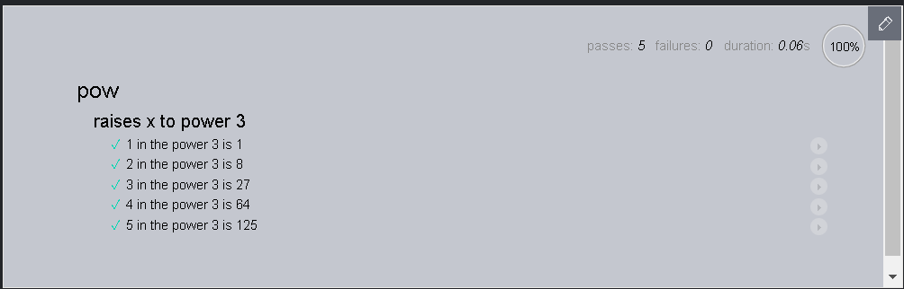

# 代码质量

## 在浏览器中调试

- 教程:[在浏览器中调试 JavaScript](https://zh.javascript.info/debugging-chrome)

- 控制台

  会显示执行效果和返回值(没有返回值, 则显示`undefined`)

- 断点

  右键行号 => 修改断点 => 添加条件语句, 即条件断点

  添加`debugger`语句, 也可以设置断点

- 查看

  - watch

    可以添加需要查看的变量

  - call stack

    可以查看函数调用栈

  - scope

    可以查看作用域, this 对象, 局部变量, 全局变量

- 输出在控制台上

  `console.log`

- 进阶学习:[Chrome DevTools](https://developers.google.com/web/tools/chrome-devtools)

## 代码风格

- 清晰易读

- 垂直方向的缩进

  通过逻辑层次进行划分, 多一些空行

- 凸显主逻辑
- 函数先调用后声明
- [风格指南](https://zh.javascript.info/coding-style#feng-ge-zhi-nan)

## 注释

- 解释性的注释应该最少

  代码本身做到自描述

- 通常情况下, 尽可能保持简洁和自描述, 可以稍微牺牲优化
- 好的注释

  - 描述架构

    高层次概括:相互作用, 控制流程

    代码的架构图: UML

  - 记录函数的参数和用法

    黑箱思想

  - 重要的解决方案

    描述为什么这样做, 而不是其他的

    避免出现以前考虑过`显而易见`的方案存在漏洞, 下次再遇到类似的问题, 自作聪明地将深思熟虑的方案改成有缺陷的`显而易见`的方案

## 忍者代码

- 辛辣的讽刺哟:[忍者代码](https://zh.javascript.info/ninja-code)

  > 大半夜, 逗得我睡不着觉, 哈哈哈, 要笑掉肚子了

## 自动化测试

使用 Mocha 进行自动化测试

- 来源场景

  避免修复一个问题却造成了另一个问题

- 解决方法

  对所有的案例进行测试, 自动化测试

  - 开发的过程就是不断迭代

    写规范, 实现它, 确保通过测试, 然后写更多的测试

- 行为驱动开发技术([BDD](https://en.wikipedia.org/wiki/Behavior-driven_development))

  - 测试 => 确保代码符合预期
  - 文档 => describe 和 it 描述函数做了什么
  - 示例 => 一个函数如何被使用

### 一个案例

- [案例](https://zh.javascript.info/testing-mocha#kai-fa-pow-gui-fan)

- 规范

  创建代码之前, 应该想象函数应该是怎样的并且描述出来

  - 包含 => 用例的描述和针对用例的测试

- 哲学

  - 一个测试检测一个东西

    ```javascript
    describe("pow", function () {
      it("2 raised to power 3 is 8", function () {
        assert.equal(pow(2, 3), 8);
      });

      it("3 raised to power 4 is 81", function () {
        assert.equal(pow(3, 4), 81);
      });
    });
    ```

  - 划分层级

    ```javascript
    describe("pow", function () {
      describe("raises x to power 3", function () {
        function makeTest(x) {
          let expected = x * x * x;
          it(`${x} in the power 3 is ${expected}`, function () {
            assert.equal(pow(x, 3), expected);
          });
        }

        for (let x = 1; x <= 5; x++) {
          makeTest(x);
        }
      });

      // ……可以在这里写更多的测试代码，describe 和 it 都可以添加在这。
    });
    ```

    

    > 类似 markdown 的层级划分, 将 makeTest 等辅助函数限定在一个代码块内

### 测试框架

```javascript
<!DOCTYPE html>
<html>
<head>
  <!-- add mocha css, to show results -->
  <link rel="stylesheet" href="https://cdnjs.cloudflare.com/ajax/libs/mocha/3.2.0/mocha.css">
  <!-- add mocha framework code -->
  <script src="https://cdnjs.cloudflare.com/ajax/libs/mocha/3.2.0/mocha.js"></script>
  <script>
    mocha.setup('bdd'); // minimal setup
  </script>
  <!-- add chai -->
  <script src="https://cdnjs.cloudflare.com/ajax/libs/chai/3.5.0/chai.js"></script>
  <script>
    // chai has a lot of stuff, let's make assert global
    let assert = chai.assert;
  </script>
</head>

<body>

  <script>
    function pow(x, n) {
      /* function code is to be written, empty now */
    }
  </script>

  <!-- the script with tests (describe, it...) -->
  <script src="test.js"></script>

  <!-- the element with id="mocha" will contain test results -->
  <div id="mocha"></div>

  <!-- run tests! -->
  <script>
    mocha.run();
  </script>
</body>

</html>
```

- 结构

  - `<head>` => 引入库
  - `<script>` => 实现代码
  - `test.js` => 测试代码
  - `id = "mocha"` => 测试结果
  - `mocha.run()` => 运行测试
