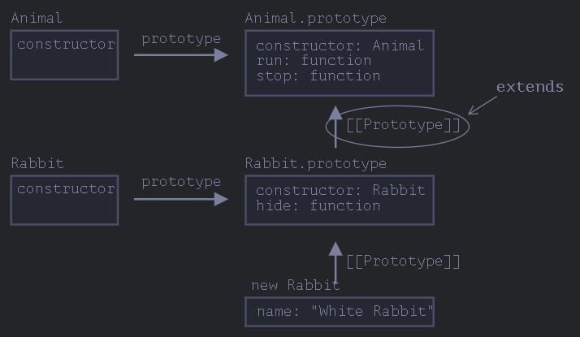
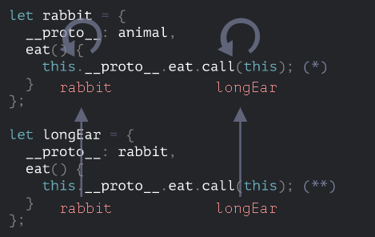
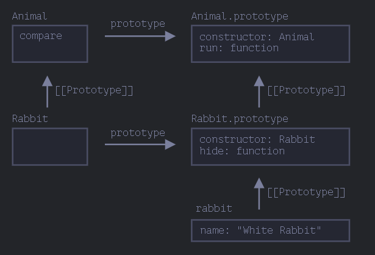
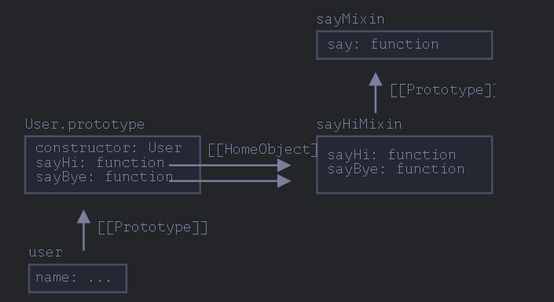

# 类

## class 基本语法

- 形式

  ```js
  class MyClass {
  prop = value; // 属性

  constructor(...) { // 构造器
      // ...
  }

  method(...) {} // method

  get something(...) {} // getter 方法
  set something(...) {} // setter 方法

  [Symbol.iterator]() {} // 有计算名称（computed name）的方法（此处为 symbol）
  // ...
  }
  ```

  注意: 方法之间没有`逗号`

- 特点

  - new 会调用`constructor`
  - `class`是一个函数

    `alert(typeof User); // function`

  - `class`内部定义的方法都是不可枚举的

  - `class`的方法被储存在`prototype`

  - 必须使用 new

- 类表达式

  和函数一样

  ```js
  let User = class {
    sayHi() {
      alert("Hello");
    }
  };
  ```

  也可以有名字, 但是只能在内部使用

  - 动态创建

    ```js
    function makeClass(phrase) {
      // declare a class and return it
      return class {
        sayHi() {
          alert(phrase);
        }
      };
    }

    // Create a new class
    let User = makeClass("Hello");

    new User().sayHi(); // Hello
    ```

    需要用 new, User 是一个类, 不是对象

- 类字段

  类中的变量 => 不会放入`prototype`中

  - 具有绑定作用

    ```js
    class Button {
      constructor(value) {
        this.value = value;
      }

      click() {
        alert(this.value);
      }
    }

    let button = new Button("hello");

    setTimeout(button.click, 1000); // undefined
    ```

    此时`this`是`undefined`

    使用箭头函数

    ```js
    class Button {
      constructor(value) {
        this.value = value;
      }

      click = () => {
        alert(this.value);
      };
    }

    let button = new Button("hello");

    setTimeout(button.click, 1000); // hello
    ```

    箭头函数没有 this, 这个 this 是从外面继承的, 而 Button 的 this 是绑定对象的

## 类继承

- `extends`

  可以为任意表达式, 但是必须是`class`

  ```js
  function f(phrase) {
    return class {
      sayHi() {
        alert(phrase);
      }
    };
  }

  class User extends f("Hello") {}

  new User().sayHi(); // Hello
  ```

- 类的结构

  

  `prototype`: 挂载方法

  `[[Prototype]]`: 挂载原型(`__proto__`)

- `super`

  - 调用父类构造器 => `super(...)`
  - 调用父类方法 => `super.method(...)`
  - 箭头函数没有 `super` => 会使用外部的 `super`

- 重写`constructor`

  派生构造器具有特殊的内部属性 `[[ConstructorKind]]`:"derived"

  - 当通过 new 执行一个常规函数时，它将创建一个空对象，并将这个空对象赋值给 this
  - 当继承的 constructor 执行时，它不会执行此操作。它期望父类的 constructor 来完成这项工作

  派生的 constructor 必须调用 super 才能执行其父类（base）的 constructor，否则 this 指向的那个对象将不会被创建

  - 类字段

    父类构造器总是会使用它自己字段的值，而不是被重写的那一个

    ```js
    class Animal {
      name = "animal";

      constructor() {
        alert(this.name); // (*)
      }
    }

    class Rabbit extends Animal {
      name = "rabbit";
    }

    new Animal(); // animal
    new Rabbit(); // animal, not rabbit
    ```

    这是由于调用父类`super`时, `Rabbit`还未创建

    而调用方法不会遇到这样的问题, 因为方法是挂在`prototype`上的, 此时类已经完全创建好了(也就是类的核心包括数据那部分, 但是方法不是)

    - 避免这个问题 => 用`get/set`来处理

- [`super`的实现](https://zh.javascript.info/class-inheritance)

  采用`this` 无法实现, 会陷入死循环

  

  方法有`[[HomeObject]]`属性, 记录了绑定的对象, 然后`super`会通过它来解析, 而不是使用 this

- 方法

  - 方法不是自由的

    有`[[HomeObject]]`属性, 意味着它被绑定了对象(仅仅被用于`super`)

    所以, 有`super`的方法不能像函数一样随意传递, 容易出错

  - 方法不是函数属性

    类应该使用方法, 而不是函数

    ```js
    let animal = {
      eat: function () {
        // 这里是故意这样写的，而不是 eat() {...
        // ...
      },
    };

    let rabbit = {
      __proto__: animal,
      eat: function () {
        super.eat();
      },
    };

    rabbit.eat(); // 错误调用 super（因为这里没有 [[HomeObject]]）
    ```

## 静态属性和静态方法

- 在前面添加`static`即是静态的

  为整个类所有

  只能通过类来调用而不是对象

- 结构

  

- [案例](https://zh.javascript.info/static-properties-methods#lei-kuo-zhan-zi-dui-xiang)

  可以用结构图来表达清楚

## 私有的和受保护的属性和方法

- 约定

  变量名前面加`_`, 是受保护的

  可以继承访问, 仅仅是约定

- 只读

  利用`get`, 不设置`set`

- 私有

  语法支持, 变量名字前加`#`

## 扩展内建类

- 内建类调用扩展类的构造函数

  ```js
  // 给 PowerArray 新增了一个方法（可以增加更多）
  class PowerArray extends Array {
    isEmpty() {
      return this.length === 0;
    }
  }

  let arr = new PowerArray(1, 2, 5, 10, 50);
  alert(arr.isEmpty()); // false

  let filteredArr = arr.filter((item) => item >= 10);
  alert(filteredArr); // 10, 50
  alert(filteredArr.isEmpty()); // false
  ```

  因为`PowerArray`继承了`Array`, 所以它的构造函数也会被调用, 则`arr.filter`返回的不是`Array`类, 而是`PowerArray`类

  可以定制这种行为

  ```js
  class PowerArray extends Array {
    isEmpty() {
      return this.length === 0;
    }

    // 内建方法将使用这个作为 constructor
    static get [Symbol.species]() {
      return Array;
    }
  }
  ```

  内建方法将调用 Symbol.species 作为构造函数

- 内建类没有静态方法继承

## 类检查

- `instanceof`

  可以检查一个对象是否是一个类的实例

  用来构建多态

- 判断过程

  - 查看内里面是否有静态方法`static [Symbol.hasInstance](obj)`
  - 递归判断

    `obj.__proto__.__proto__ == Class.prototype`

    类似的方法`objA.isPrototypeOf(objB)`

- 通过`toString`转发

  `Object.prototype.toString.call(obj)`判断类型

  - 可以用添加属性改变`toString`的输出

    `[Symbol.toStringTag] : 'MyClass'`

## Mixin 模式

- js 没有多继承

  通过 Mixin 模式来解决

  将其他类的方法直接复制到当前类中, 实现了继承的效果(但不是继承, 而且不影响继承)

- 用法

  ```js
  // mixin
  let sayHiMixin = {
    sayHi() {
      alert(`Hello ${this.name}`);
    },
    sayBye() {
      alert(`Bye ${this.name}`);
    },
  };

  // 用法：
  class User {
    constructor(name) {
      this.name = name;
    }
  }

  // 拷贝方法
  Object.assign(User.prototype, sayHiMixin);

  // 现在 User 可以打招呼了
  new User("Dude").sayHi(); // Hello Dude!
  ```

  `super`不会受到影响

  

- [经典案例](https://zh.javascript.info/mixins#eventmixin)

  良好的设计模式
