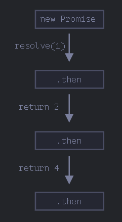
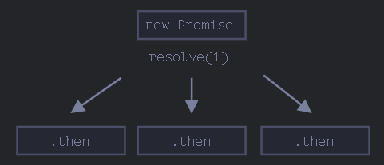
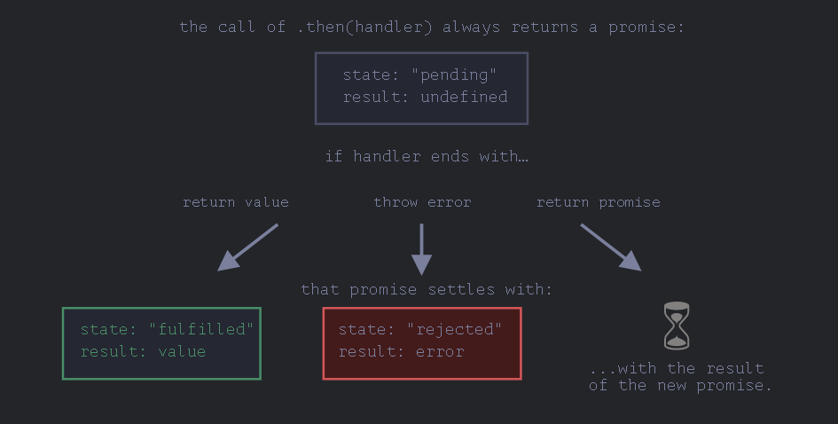

# Promise-async/await

相当于 Haskell 的 do-notation

## Promise

类似`订阅模型`

针对的是回调, 异步加载

```js
let promise = new Promise(function (resolve, reject) {
  if (true) {
    resolve("成功");
  } else {
    reject("失败");
  }
})
  .then(
    function () {
      // handle a successful result
    },
    function () {
      // handle an error
    }
  )
  .catch(function (err) {
    // do something
  })
  .finally(function () {
    // do something
  })
  .done();
```

- `new Promise()`

  异步执行里面函数

  - `resolve(value)`

    调用`then`里面的第一个函数

  - `reject(err)`
    调用`then`里面的第二个函数

- `then`

  回调函数

- `catch`

  等价于`then(null, errFunc)`

- `finally`

  不会影响返回结果

## Promise 链

- 继承式链式

  结果会被传递

  ```js
  new Promise(function (resolve, reject) {
    setTimeout(() => resolve(1), 1000); // (*)
  })
    .then(function (result) {
      // (**)

      alert(result); // 1
      return result * 2;
    })
    .then(function (result) {
      // (***)

      alert(result); // 2
      return result * 2;
    })
    .then(function (result) {
      alert(result); // 4
      return result * 2;
    });
  ```

  

- 注意以下形式的区别

  ```js
  let promise = new Promise(function (resolve, reject) {
    setTimeout(() => resolve(1), 1000);
  });

  promise.then(function (result) {
    alert(result); // 1
    return result * 2;
  });

  promise.then(function (result) {
    alert(result); // 1
    return result * 2;
  });

  promise.then(function (result) {
    alert(result); // 1
    return result * 2;
  });
  ```

  

- 异步行为链

  ```js
  new Promise(function (resolve, reject) {
    setTimeout(() => resolve(1), 1000);
  })
    .then(function (result) {
      alert(result); // 1

      return new Promise((resolve, reject) => {
        // (*)
        setTimeout(() => resolve(result * 2), 1000);
      });
    })
    .then(function (result) {
      // (**)

      alert(result); // 2

      return new Promise((resolve, reject) => {
        setTimeout(() => resolve(result * 2), 1000);
      });
    })
    .then(function (result) {
      alert(result); // 4
    });
  ```

  不是同一个 promise, 但是逻辑上是连贯的

  - 变形

    ```js
    loadScript("/article/promise-chaining/one.js")
      .then((script) => loadScript("/article/promise-chaining/two.js"))
      .then((script) => loadScript("/article/promise-chaining/three.js"))
      .then((script) => {
        // 脚本加载完成，我们可以在这儿使用脚本中声明的函数
        one();
        two();
        three();
      });
    ```

- 流程图

  

- 一个案例:[fetch](https://zh.javascript.info/promise-chaining#geng-fu-za-de-shi-li-fetch)

  fetch 会返回 promise, 可以看到网络广泛应用异步逻辑链

## 使用 promise 进行错误处理

- 隐式的`try...catch`

  ```js
  new Promise((resolve, reject) => {
    throw new Error("Whoops!");
  }).catch(alert); // Error: Whoops!
  ```

  ```js
  new Promise((resolve, reject) => {
    reject(new Error("Whoops!"));
  }).catch(alert); // Error: Whoops!
  ```

  一旦抛出错误后, 会被附近的 catch 捕捉

  - 如果 catch 处理完后, 则会执行后续的 then
  - 如果不能处理, 则应该重新抛出错误, 继续被下一 catch 捕捉

    - 如果没有 catch, 则会卡住

      浏览器会会生成事件, 以下可以捕捉

      ```js
      window.addEventListener("unhandledrejection", function (event) {
        // 这个事件对象有两个特殊的属性：
        alert(event.promise); // [object Promise] —— 生成该全局 error 的 promise
        alert(event.reason); // Error: Whoops! —— 未处理的 error 对象
      });

      new Promise(function () {
        throw new Error("Whoops!");
      }); // 没有用来处理 error 的 catch
      ```

  同步错误才会处理, 异步抛出的不会

## Promise API

- `Promise.all` 并行处理多个 promise

  如果有失败的, 虽然会执行, 但是后续执行的结果不会返回(也就是期待全部完成)

  ```js
  let urls = [
    "https://api.github.com/users/iliakan",
    "https://api.github.com/users/remy",
    "https://api.github.com/users/jeresig",
  ];

  // 将每个 url 映射（map）到 fetch 的 promise 中
  let requests = urls.map((url) => fetch(url));

  // Promise.all 等待所有任务都 resolved
  Promise.all(requests).then((responses) =>
    responses.forEach((response) =>
      alert(`${response.url}: ${response.status}`)
    )
  );
  ```

- `Promise.allSettled`

  同时关心失败和成功

- `Promise.race`

  关心最快出结果(无论失败还是成功)的那个

- `Promise.any`

  关心最快成功的那个

  所有都失败会返回`AggregateError`

- `Promise.solve`

  相当于将`value`封装进入`promise`

  被`async/await`语法取代

## Promisification

- 转化为这一形式, 或说模式

- 参考: [Promisification](https://zh.javascript.info/promisify)

## 微任务

- 只有在 JavaScript 引擎中没有其它任务在运行时，才开始执行任务队列中的任务
- `.then/catch/finally` 处理程序总是在当前代码完成后才会被调用

## async/await

- 更舒适的方式使用 promise 的一种特殊语法

- `async`

  `async` 确保了函数返回一个 promise，也会将非 promise 的值包装进去

- `await`

  - 只在 async 函数内工作

  - 形式:`let value = await promiseID;`

    等待`promiseID`完成, 并接收最后的结果

  - await 只要对象形似`thenables`

    只要对面能有 then 方法, 得到的结果就是 then 接受的参数

    !> 只需要 then

  > 可以看作出了一个 promise, 那么它就是微任务, 想象成是一个新的线程, 后续的代码会立即执行, 而不会等待线程执行完成结果

### 应用

- 使用 await 得到返回结果

  ```js
  async function compress(fileName) {
    return await image.compress(fileName).then((file) => {
      if (fs.existSync(file)) {
        return true;
      } else {
        return false;
      }
    });
  }
  ```

  await 会等待返回结果, 等待返回 true 还是 false

- 将一些异步转化为 await 形式, 通过 promise 构造

  ```js
  async function executeCommamd() {
    return new promise((resolve) => {
      spawn(command)
        .on("close", () => resolve(true))
        .on("error", () => resolve(false));
    });
  }
  ```

  await 会等待 resolve(其实也就相当于进入 then)

### reference

- [Return multiple variables on async/await](https://stackoverflow.com/questions/46090163/return-multiple-variables-on-async-await)

  You'd better return an array.
