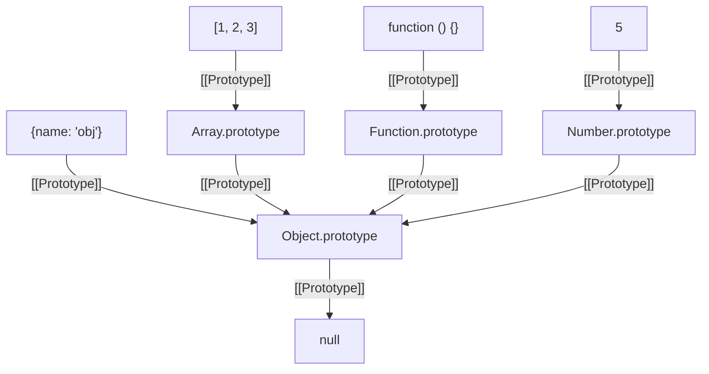

# 原型

js 对于类采用的是[原型设计模式](https://refactoring.guru/design-patterns/prototype), 构造函数其实是[factory](https://refactoring.guru/design-patterns/factory-method)

与 c++不同的是, c++采用的是模板, 通过模板生成类, 类的继承是在模板上面设计. js 的原型设计意味着类其实就是一个对象, 实例化其实是 clone

```js
let animal = {
  eats: true,
};
let rabbit = {
  jumps: true,
};

rabbit.__proto__ = animal; // sets rabbit.[[Prototype]] = animal
```

上面可以看到 animal 既是一个模板(class), 又是一个实例(object)

参考[docsify 运用的模板设计](https://github.com/docsifyjs/docsify/blob/898e6eea7a7d5bf34a428d672d6a1b8c7896d183/src/core/router/index.js#L22-L67), 函数可以返回一个类. 充分说明了原型设计

---

js 用`[[Prototype]]`记录继承关系, `__proto__` 是`[[Prototype]]`的 getter/setter. 只支持单继承, 实际上就是一个链表的设计, 形成一个原型链

?> 推荐 `Object.getPrototypeOf/Object.setPrototypeOf` 来取代 `__proto__` 去 `get/set` 原型

---

js 只是在 read 的时候使用 prototype chain, 在 write/delete 的时候不会使用 prototype chain

```js
const sound = rabbit.sound; // 会从prototype chain中寻找
rabbit.move = function () {}; // 直接赋值在当前的对象上
```

而 this 由于是动态的, 即时当前调用的对象

```js
let animal = {
  sleep() {
    this.isSleeping; // 谁调用, 这个this指向谁
  },
};

let rabbit = {
  __proto__: animal,
};

animal.sleep(); // this -> animal
rabbit.sleep(); // this -> rabbit
```

然后 this 确定后, 依然根据 read 还是 write 来确定是否需要从 prototype chain 中寻找

于是,

- example: [Working with prototype](https://javascript.info/prototype-inheritance#working-with-prototype)

  表明, 父类删除某种属性, 对子类的 read 有影响

- example: [Why are both hamsters full?](https://javascript.info/prototype-inheritance#working-with-prototype)

  ```js
  this.stomach.push(food);
  ```

  子类调用时, 首先这是一个 read(this.stomach), 由于本身都没有 stomach, 会找父类的, 于是共用了父类的一个 stomach

  如果采用 write 方式, 则不会

  ```js
  this.stomach = [food];
  ```

  此时的 this 会是子类, 于是会在子类上创建一个 stomach

  最好的方式是, 子类自己有一个 stomach

## function

函数是一个特殊的对象, 它有一个特殊的属性`prototype`. 默认如下:

```js
function Rabbit() {}

/* default prototype
Rabbit.prototype = { constructor: Rabbit };
*/
```

可以人为设定:

```js
Rabbit.prototype = animal;
```

?> F.prototype only used at new F time

---

```js
let animal = {
  eats: true,
};

function Rabbit(name) {
  this.name = name;
}

Rabbit.prototype = animal;

let rabbit = new Rabbit("White Rabbit"); //  rabbit.__proto__ == animal

alert(rabbit.eats); // true
```

`new Rabbit` 会如下执行:

1. 创建一个空对象`{}`, this 指向空对象
2. 空对象的`[[Prototype]]`指向`Rabbit.prototype`
3. `this.name = name`会按照一般的 read/write, 这是会在当前对象创建属性

---

Native prototypes [^modern native]

js 的原生对象采用的是 factory 方式

- `{}`其实是`obj = new Object()`的简便方式
- `[]`是`arr = new Array()`的简便方式
- `Function`是`func = new Function()`的简便方式 [^modern new func]



一般把类挂载在**构造函数**的 prototype 上面

?> 所以可以通过修改 prototype, 如添加某个方法, 来扩展原生对象

## Class

```js
class MyClass {
prop = value; // 属性

constructor(...) { // 构造器
    // ...
}

method(...) {} // method

get something(...) {} // getter 方法
set something(...) {} // setter 方法

[Symbol.iterator]() {} // 有计算名称（computed name）的方法（此处为 symbol）
// ...
}
```

!> 方法之间没有`逗号`

## class is function

类表达式

```js
let User = class {
  sayHi() {
    alert("Hello");
  }
};
```

---

动态创建

```js
function makeClass(phrase, base) {
  // declare a class and return it
  return class {
    sayHi() {
      alert(phrase);
    }
  };
}

// Create a new class
let User = makeClass("Hello");

new User().sayHi(); // Hello
```

参考[docsify 运用的模板设计](https://github.com/docsifyjs/docsify/blob/898e6eea7a7d5bf34a428d672d6a1b8c7896d183/src/core/router/index.js#L22-L67)可以实现模板

## inheritance

- `extends` 来继承
- `super`

  - 调用父类构造器 => `super(...)`

    在 constructor 的时候使用, `super`与`this`即是类, 类是函数, 在 new 之后的对象里, 即是对象

  - 调用父类方法 => `super.method(...)`
  - 箭头函数没有 `super` => 会使用外部的 `super`

## static

factory 函数之间的属性继承, 而不是 f.prototype 的继承 [^modern static]

!> 内建类没有静态方法继承

## protect

- 保护: `_`开头变量

- 私有: `#`开头变量

## References

1. [Prototypes, inheritance](https://javascript.info/prototypes)
2. [-modern native] [Native prototypes](https://javascript.info/native-prototypes)
3. [-modern new func] [The "new Function" syntax](https://javascript.info/new-function)
4. [-modern static] [Static properties and methods](https://javascript.info/static-properties-methods)
