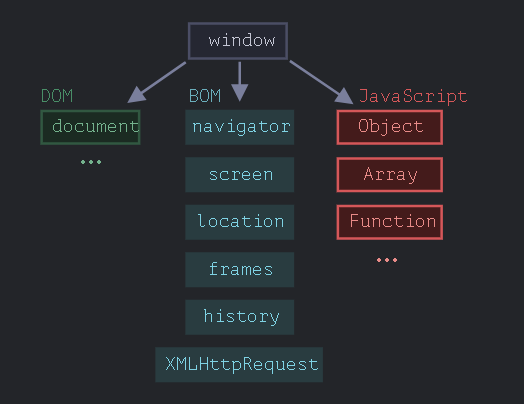
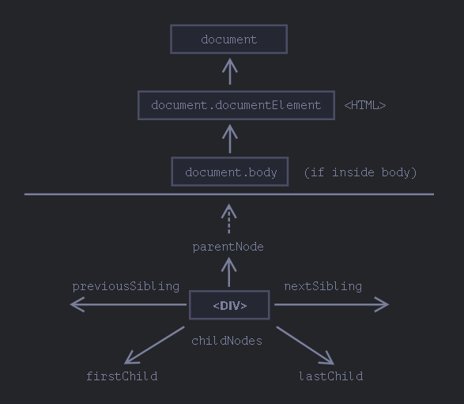
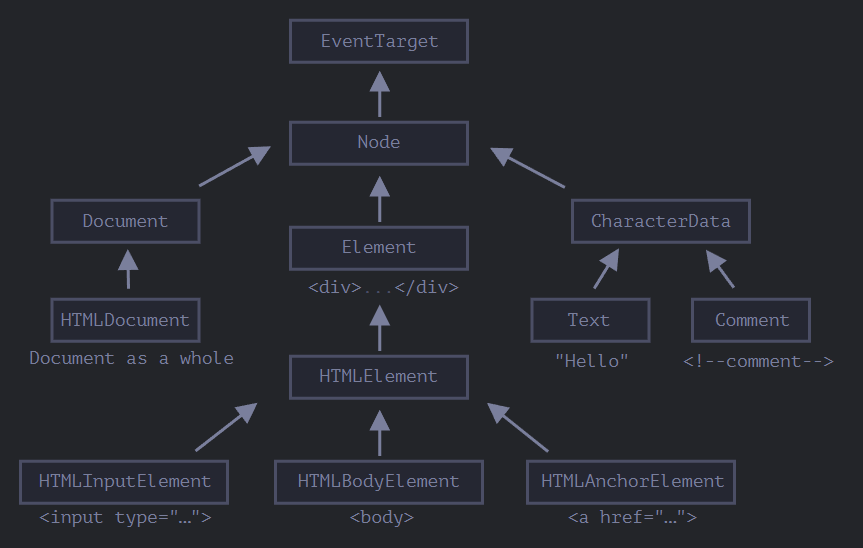

# document

## 浏览器环境-规格



- window => "根"对象

  - 它是 JavaScript 代码的全局对象
  - 代表"浏览器窗口",并提供了控制它的方法

- 文档对象模型(DOM)

  - 将所有页面内容表示为可以修改的对象

- 浏览器对象模型(BOM)

  表示由浏览器(主机环境)提供的用于处理文档(document)之外的所有内容的其他对象

  - eg

    - navigator 对象提供了有关浏览器和操作系统的背景信息
    - location 对象允许我们读取当前 URL,并且可以将浏览器重定向到新的 URL

## DOM 树

- DOM 是一个树的结构

  - html 的任何部分都对应着树

    - 包括注释
    - 换行, 空格, tab 都会被树给包含(通常被工具隐藏), 形成文本节点
    - 表格永远有`<tbody>`标签

  - 树由节点构成

    每个节点都是对象

    - 标签被称为元素节点(或元素)
    - 文本被称为文本节点
    - 注释节点
    - document => DOM 入口点

- `$0`表示当前选中元素(控制台变量)

- 参考: [Chrome DevTools](https://developer.chrome.com/docs/devtools/)

## 遍历 DOM

- 结构

  

- 顶层

  `<html> = document.documentElement`

  `<body> = document.body`

  `<head> = document.head`

  !> `<head>` 中的 `<script>` 访问不到 `<body>`, 因为此时 `<body>` 还没有加载, 也就是`<script>` 只能看到它之前的内容

- 子节点

  - `childNodes` 所有子节点

    文本节点, 元素节点, 注释节点等

    性质为集合, 只读, 可迭代

  - `firstChild` 第一个子节点

    `elem.firstChild == elem.childNodes[0]`

  - `lastChild` 最后一个子节点

    `elem.lastChild == elem.childNodes[elem.childNodes.length - 1]`

- 兄弟节点

  - `nextSibling` 下一个兄弟节点
  - `previousSibling` 前一个兄弟节点

- 父节点

  - `parentNode` 父节点

- 纯元素导航

  - `children` 所有子元素
  - `firstElementChild` 第一个子元素
  - `lastElementChild` 最后一个子元素
  - `nextElementSibling` 下一个兄弟元素
  - `previousElementSibling` 前一个兄弟元素
  - `parentElement` 父元素

    `parentElement`与`parentNode`的区别是, 当父节点是`document`时, `parentElement`返回`null`

- [表格](https://zh.javascript.info/dom-navigation#dom-navigation-tables)

## 搜索

- 通过 id

  - 函数`document.getElementById(id)`

  - id 即是全局变量

    ```js
    <div id="elem">
    <div id="elem-content">Element</div>
    </div>

    <script>
    // elem 是对带有 id="elem" 的 DOM 元素的引用
    elem.style.background = 'red';

    // id="elem-content" 内有连字符，所以它不能成为一个变量
    // ...但是我们可以通过使用方括号 window['elem-content'] 来访问它
    </script>
    ```

    !> 不推荐, 容易与命名冲突, 而且不容易分析 js 中变量的来源

### 通过 CSS 选择器

[CSS 选择器](https://developer.mozilla.org/en-US/docs/Web/CSS/CSS_Selectors)

- 函数 `document.querySelectorAll(css_selector)`

  返回的是所有匹配的列表

  返回第一个, `document.querySelector()`

> getElementByTagName 而不是 getElementsByTagName

!> `getElementsBy*` 方法都会返回一个 实时的(live) 集合, 即如果有元素添加, 会更新; 而 `querySelectorAll` 返回的是一个静态的集合, 即如果有元素添加, 不会更新, 除非重新使用 `querySelectorAll` 获取

- 根据属性来选择

  ```html
  <div data-widget-name="menu">Choose the genre</div>
  <script>
    // 获取它
    let elem = document.querySelector("[data-widget-name]");
  </script>
  ```

## 节点属性

每个 DOM 节点都属于相应的内建类



> 给定节点的全部属性和方法都是继承链的结果

### innerHTML

内容

将元素中的 HTML 获取为字符串形式

!> “innerHTML+=” 会进行完全重写内容, see [Is it possible to append to innerHTML without destroying descendants' event listeners?](https://stackoverflow.com/questions/595808/is-it-possible-to-append-to-innerhtml-without-destroying-descendants-event-list)

### outerHTML

元素的完整 HTML

就像 innerHTML 加上元素本身一样

!> 与 `innerHTML` 不同，写入 `outerHTML` 不会改变元素。而是在 DOM 中替换它

### nodeValue/data

文本节点内容

!> innerHTML 属性仅对元素节点有效, 对于文本节点和注释节点的访问得用这个属性

### textContent

纯文本

仅文本，去掉所有 `<tags>`

- 使用 `innerHTML`，我们将其“作为 HTML”插入，带有所有 HTML 标签
- 使用 `textContent`，我们将其“作为文本”插入，所有符号（symbol）均按字面意义处理

### hidden

指定元素是否可见

hidden 与 `style="display:none"` 做的是相同的事。但 hidden 写法更简洁

### length

子元素的个数

### reference

- Interface description language. (2022, May 29). In Wikipedia. https://en.wikipedia.org/wiki/Interface_description_language

  DOM 类不是使用 JavaScript 来描述的，而是一种特殊的 接口描述语言（Interface description language）

## 特性和属性

Attributes and properties

特性（attribute）—— 写在 HTML 中的内容。
属性（property）—— DOM 对象中的内容。

对于元素节点，大多数标准的 HTML 特性（attributes）会自动变成 DOM 对象的属性（properties）

当浏览器解析 HTML 文本，并根据标签创建 DOM 对象时，浏览器会辨别标准的特性并以此创建 DOM 属性, 但是非标准的特性则不会

对于非标准属性

- elem.hasAttribute(name) —— 检查特性是否存在。
- elem.getAttribute(name) —— 获取这个特性值。
- elem.setAttribute(name, value) —— 设置这个特性值。
- elem.removeAttribute(name) —— 移除这个特性。

`elem.attributes` 集合是可迭代对象，该对象将所有元素的特性（标准和非标准的）作为 name 和 value 属性存储在对象中

### 属性-特性同步

当一个标准的特性被改变，对应的属性也会自动更新，（除了几个特例）反之亦然

也有些例外，例如 input.value 只能从特性同步到属性，反过来则不行, 即 HTML -> DOM

### DOM 属性是多类型的

`input.checked` 属性（对于 checkbox 的）是布尔型的, 使用 getAttribute 得到的是空字符串

style 特性是字符串类型的，但 style 属性是一个对象

href 特性可能不同

```html
<a id="a" href="#hello">link</a>
<script>
  // 特性
  alert(a.getAttribute("href")); // #hello

  // 属性
  alert(a.href); // http://site.com/page#hello 形式的完整 URL
</script>
```

### dataset

HTML 语言是在不断发展的，并且更多的特性出现在了标准中，以满足开发者的需求. 可能非标准的特性会变成标准特性, 为避免冲突存在 `data-*` 特性

> 所有以 “data-” 开头的特性均被保留供程序员使用。它们可在 dataset 属性中使用

- example

  如果一个 elem 有一个名为 "data-about" 的特性，那么可以通过 `elem.dataset.about` 取到它

  像 `data-order-state` 这样的多词特性可以以驼峰式进行调用：`dataset.orderState`

## 修改文档
