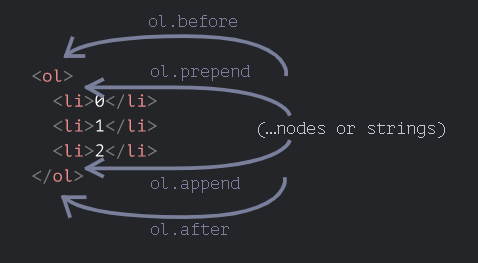
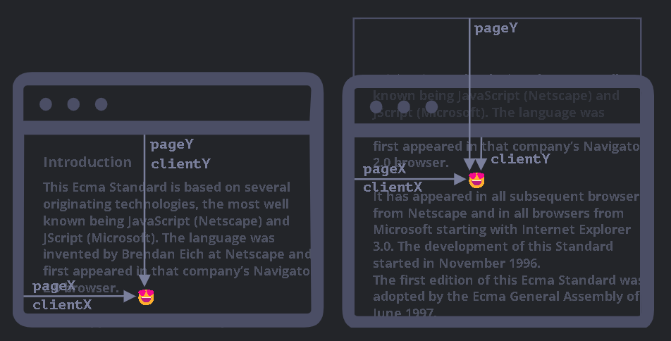

# document

## 浏览器环境-规格


- window => "根"对象

  - 它是 JavaScript 代码的全局对象
  - 代表"浏览器窗口",并提供了控制它的方法

- 文档对象模型(DOM)

  - 将所有页面内容表示为可以修改的对象

- 浏览器对象模型(BOM)

  表示由浏览器(主机环境)提供的用于处理文档(document)之外的所有内容的其他对象

  - eg

    - navigator 对象提供了有关浏览器和操作系统的背景信息
    - location 对象允许我们读取当前 URL,并且可以将浏览器重定向到新的 URL

## DOM 树

- DOM 是一个树的结构

  - html 的任何部分都对应着树

    - 包括注释
    - 换行, 空格, tab 都会被树给包含(通常被工具隐藏), 形成文本节点
    - 表格永远有`<tbody>`标签

  - 树由节点构成

    每个节点都是对象

    - 标签被称为元素节点(或元素)
    - 文本被称为文本节点
    - 注释节点
    - document => DOM 入口点

- `$0`表示当前选中元素(控制台变量)

- 参考: [Chrome DevTools](https://developer.chrome.com/docs/devtools/)

## 遍历 DOM

- 结构

  

- 顶层

  `<html> = document.documentElement`

  `<body> = document.body`

  `<head> = document.head`

  !> `<head>` 中的 `<script>` 访问不到 `<body>`, 因为此时 `<body>` 还没有加载, 也就是`<script>` 只能看到它之前的内容

- 子节点

  - `childNodes` 所有子节点

    文本节点, 元素节点, 注释节点等

    性质为集合, 只读, 可迭代

  - `firstChild` 第一个子节点

    `elem.firstChild == elem.childNodes[0]`

  - `lastChild` 最后一个子节点

    `elem.lastChild == elem.childNodes[elem.childNodes.length - 1]`

- 兄弟节点

  - `nextSibling` 下一个兄弟节点
  - `previousSibling` 前一个兄弟节点

- 父节点

  - `parentNode` 父节点

- 纯元素导航

  - `children` 所有子元素
  - `firstElementChild` 第一个子元素
  - `lastElementChild` 最后一个子元素
  - `nextElementSibling` 下一个兄弟元素
  - `previousElementSibling` 前一个兄弟元素
  - `parentElement` 父元素

    `parentElement`与`parentNode`的区别是, 当父节点是`document`时, `parentElement`返回`null`

- [表格](https://zh.javascript.info/dom-navigation#dom-navigation-tables)

## 搜索

- 通过 id

  - 函数`document.getElementById(id)`

  - id 即是全局变量

    ```js
    <div id="elem">
    <div id="elem-content">Element</div>
    </div>

    <script>
    // elem 是对带有 id="elem" 的 DOM 元素的引用
    elem.style.background = 'red';

    // id="elem-content" 内有连字符，所以它不能成为一个变量
    // ...但是我们可以通过使用方括号 window['elem-content'] 来访问它
    </script>
    ```

    !> 不推荐, 容易与命名冲突, 而且不容易分析 js 中变量的来源

### 通过 CSS 选择器

[CSS 选择器](https://developer.mozilla.org/en-US/docs/Web/CSS/CSS_Selectors)

- 函数 `document.querySelectorAll(css_selector)`

  返回的是所有匹配的列表

  返回第一个, `document.querySelector()`

> getElementByTagName 而不是 getElementsByTagName

!> `getElementsBy*` 方法都会返回一个 实时的(live) 集合, 即如果有元素添加, 会更新; 而 `querySelectorAll` 返回的是一个静态的集合, 即如果有元素添加, 不会更新, 除非重新使用 `querySelectorAll` 获取

- 根据属性来选择

  ```html
  <div data-widget-name="menu">Choose the genre</div>
  <script>
    // 获取它
    let elem = document.querySelector("[data-widget-name]");
  </script>
  ```

## 节点属性

每个 DOM 节点都属于相应的内建类


> 给定节点的全部属性和方法都是继承链的结果

### innerHTML

内容

将元素中的 HTML 获取为字符串形式

!> “innerHTML+=” 会进行完全重写内容, see [Is it possible to append to innerHTML without destroying descendants' event listeners?](https://stackoverflow.com/questions/595808/is-it-possible-to-append-to-innerhtml-without-destroying-descendants-event-list)

### outerHTML

元素的完整 HTML

就像 innerHTML 加上元素本身一样

!> 与 `innerHTML` 不同，写入 `outerHTML` 不会改变元素。而是在 DOM 中替换它

### nodeValue/data

文本节点内容

!> innerHTML 属性仅对元素节点有效, 对于文本节点和注释节点的访问得用这个属性

### textContent

纯文本

仅文本，去掉所有 `<tags>`

- 使用 `innerHTML`，我们将其“作为 HTML”插入，带有所有 HTML 标签
- 使用 `textContent`，我们将其“作为文本”插入，所有符号（symbol）均按字面意义处理

### hidden

指定元素是否可见

hidden 与 `style="display:none"` 做的是相同的事。但 hidden 写法更简洁

### length

子元素的个数

### reference

- Interface description language. (2022, May 29). In Wikipedia. https://en.wikipedia.org/wiki/Interface_description_language

  DOM 类不是使用 JavaScript 来描述的，而是一种特殊的 接口描述语言（Interface description language）

## 特性和属性

Attributes and properties

特性（attribute）—— 写在 HTML 中的内容。
属性（property）—— DOM 对象中的内容。

对于元素节点，大多数标准的 HTML 特性（attributes）会自动变成 DOM 对象的属性（properties）

当浏览器解析 HTML 文本，并根据标签创建 DOM 对象时，浏览器会辨别标准的特性并以此创建 DOM 属性, 但是非标准的特性则不会

对于非标准属性

- elem.hasAttribute(name) —— 检查特性是否存在。
- elem.getAttribute(name) —— 获取这个特性值。
- elem.setAttribute(name, value) —— 设置这个特性值。
- elem.removeAttribute(name) —— 移除这个特性。

`elem.attributes` 集合是可迭代对象，该对象将所有元素的特性（标准和非标准的）作为 name 和 value 属性存储在对象中

### 属性-特性同步

当一个标准的特性被改变，对应的属性也会自动更新，（除了几个特例）反之亦然

也有些例外，例如 input.value 只能从特性同步到属性，反过来则不行, 即 HTML -> DOM

### DOM 属性是多类型的

`input.checked` 属性（对于 checkbox 的）是布尔型的, 使用 getAttribute 得到的是空字符串

style 特性是字符串类型的，但 style 属性是一个对象

href 特性可能不同

```html
<a id="a" href="#hello">link</a>
<script>
  // 特性
  alert(a.getAttribute("href")); // #hello

  // 属性
  alert(a.href); // http://site.com/page#hello 形式的完整 URL
</script>
```

### dataset

HTML 语言是在不断发展的，并且更多的特性出现在了标准中，以满足开发者的需求. 可能非标准的特性会变成标准特性, 为避免冲突存在 `data-*` 特性

> 所有以 “data-” 开头的特性均被保留供程序员使用。它们可在 dataset 属性中使用

- example

  如果一个 elem 有一个名为 "data-about" 的特性，那么可以通过 `elem.dataset.about` 取到它

  像 `data-order-state` 这样的多词特性可以以驼峰式进行调用：`dataset.orderState`

## 修改文档

### 创建元素

- `document.createElement(tag)` -- 创建一个元素节点

### 完全修改

- `innerHTML`

### 插入

- `elem.append(...nodes or strings)` -- 在 elem 的最后插入内容
- `elem.prepend(...nodes or strings)` -- 在 elem 的最前插入内容
- `elem.before(...nodes or strings)` -- 在 elem 之前插入内容
- `elem.after(...nodes or strings)` -- 在 elem 之后插入内容
- `elem.replaceWith(...nodes or strings)` -- 替换 elem

!> `string` 代表的是完全文本, 比如`<div>hello</div>` 会被当做文本插入, 而不会转化为元素

对于元素`ol`



### insertAdjacentHTML/Text/Element

- `elem.insertAdjacentHTML(where, html)` -- 在 elem 的指定位置插入 HTML

  `where` 可以是以下值:

  - `"beforebegin"` -- 在 elem 之前插入内容
  - `"afterbegin"` -- 在 elem 内部的开头插入内容
  - `"beforeend"` -- 在 elem 内部的末尾插入内容
  - `"afterend"` -- 在 elem 之后插入内容

- `elem.insertAdjacentText(where, text)` -- 在 elem 的指定位置插入文本

- `elem.insertAdjacentElement(where, elem)` -- 在 elem 的指定位置插入元素

### remove

- `elem.remove()` -- 删除 elem

## move

!> 如果我们要将一个元素 移动 到另一个地方，则无需将其从原来的位置中删除. 所有插入方法都会自动从旧位置删除该节点

```html
<div id="first">First</div>
<div id="second">Second</div>
<script>
  // 无需调用 remove
  second.after(first); // 获取 #second，并在其后面插入 #first
</script>
```

### clone

- `elem.cloneNode(boolean)` -- 复制 elem

  true 时, 会复制 elem 的所有后代

  false 时, 只复制 elem 本身

### DocumentFragment

用作来传递节点列表的包装器（wrapper）

相当于一个容器, 包装了 html 内容, 是的操作 html 内容能像 dom 对象一样, 然后添加给其他的节点的时候, 只会贡献自己的内容

主要是因为它上面有一些概念，例如 template 元素

### 旧的插入与移除

- `elem.appendChild(node)` -- 在 elem 的最后插入一个节点
- `elem.insertBefore(node, nextSibling)` -- 在 elem 的指定位置插入一个节点
- `elem.replaceChild(node, oldChild)` -- 替换 elem 的子节点
- `elem.removeChild(node)` -- 删除 elem 的一个节点

### 练习

- 移除列表中的子节点

  ```js
  function clear(elem) {
    while (elem.firstChild) {
      elem.firstChild.remove();
    }
  }
  ```

- [为什么留下 "aaa"？](https://zh.javascript.info/modifying-document#wei-shi-mo-liu-xia-aaa)

## 样式和类

访问 style 属性

- `elem.style` -- 读取和设置元素的样式

  读取样式时, 返回的是一个字符串, 但是设置样式时, 可以使用驼峰式

  ```js
  elem.style.width = "100px";
  elem.style.backgroundColor = "red";
  ```

### className 和 classList

`elem.className` 对应于 "class" attribute

`elem.classList` 特殊的对象

针对 html 里面多个类

```html
<body class="main page">
  <script>
    // 添加一个 class
    // 原本是 main 和 page 类
    document.body.classList.add("article");

    alert(document.body.className); // main page article
  </script>
</body>
```

- `elem.classList.add/remove/toggle("class")` -- 添加/删除/切换类

### 元素样式

对于多词（multi-word）属性，使用驼峰式 camelCase

example:

```js
background-color  => elem.style.backgroundColor
z-index           => elem.style.zIndex
border-left-width => elem.style.borderLeftWidth
```

前缀

```js
-moz-border-radius => elem.style.MozBorderRadius
-ms-border-radius  => elem.style.MsBorderRadius
```

> 连字符 `-` 表示大写

### 重置样式属性

如果我们将 `style.display` 设置为空字符串，那么浏览器通常会应用 CSS 类以及内建样式，就好像根本没有这样的 `style.display` 属性一样

或者 `elem.style.removeProperty('style property')`

!> 注意单位, 不应该将 `elem.style.top` 设置为 `10`，而应将其设置为 `10px`

### getComputedStyle

style 属性仅对 "style" 特性（attribute）值起作用，而没有任何 CSS 级联（cascade）. 因此我们无法使用 `elem.style` 读取来自 CSS 类的任何内容

`getComputedStyle(elem, [pseudo])` -- 返回一个对象，其中包含所有计算后的样式

- `pseudo`

  伪元素（如果需要），例如 ::before。空字符串或无参数则意味着元素本身

!>JavaScript 看不到 `:visited` 所应用的样式

## 元素大小和滚动

!> 不要从 CSS 中获取 width/height

## Window 大小和滚动

### 窗口的 width/height

clientWidth/clientHeight 会提供没有滚动条（减去它）的 width/height。换句话说，它们返回的是可用于内容的文档的可见部分的 width/height

!> window.innerWidth/innerHeight 包含了滚动条

### 文档的 width/height

```js
let scrollHeight = Math.max(
  document.body.scrollHeight,
  document.documentElement.scrollHeight,
  document.body.offsetHeight,
  document.documentElement.offsetHeight,
  document.body.clientHeight,
  document.documentElement.clientHeight
);
```

### 获得当前滚动

使用 `document.documentElement.scrollLeft/scrollTop`

可以从 `window.pageXOffset/pageYOffset` 中获取页面当前滚动信息

- `window.pageXOffset` 是 `window.scrollX` 的别名
- `window.pageYOffset` 是 `window.scrollY` 的别名

### 滚动

!> 必须在 DOM 完全构建好之后才能通过 JavaScript 滚动页面。例如，如果我们尝试通过 <head> 中的脚本滚动页面，它将无法正常工作

- 绝对值

  ```js
  window.scrollTo(pageX, pageY);
  window.scroll(x, y);
  ```

- 相对值

  相对于当前滚动位置

  ```js
  window.scrollBy(x, y);
  ```

- `scrollIntoView`

  - `top=true`（默认值），页面滚动，使 elem 出现在窗口顶部。元素的上边缘将与窗口顶部对齐

    类似于点击了 anchor

  - top=false，页面滚动，使 elem 出现在窗口底部。元素的底部边缘将与窗口底部对齐

### 禁止滚动

- `document.body.style.overflow = "hidden"`

  禁止滚动

- `document.body.style.overflow = ""`

  恢复

  允许滚动

## 坐标

- 相对于窗口 -- 类似于 position:fixed，从窗口的顶部/左侧边缘计算得出

  我们将这些坐标表示为 clientX/clientY

- 相对于文档 -- 与文档根（document root）中的 position:absolute 类似，从文档的顶部/左侧边缘计算得出

  我们将它们表示为 pageX/pageY



### 元素坐标

`getBoundingClientRect()`

主要的 DOMRect 属性：

- x/y -- 矩形原点相对于窗口的 X/Y 坐标
- width/height -- 矩形的 width/height（可以为负）

派生（derived）属性：

- top/bottom -- 顶部/底部矩形边缘的 Y 坐标
- left/right -- 左/右矩形边缘的 X 坐标

### elementFromPoint(x, y)

返回在窗口坐标 (x, y) 处嵌套最多（the most nested）的元素

!> 只对在可见区域内的坐标 (x,y) 起作用

### 用于 “fixed” 定位

fixed, 相当于固定在 window 的相对位置, 而不是 document 的相对位置

### 文档坐标

窗口坐标对应于 `position:fixed`，而文档坐标与顶部的 `position:absolute` 类似

- pageY = clientY + 文档的垂直滚动出的部分的高度
- pageX = clientX + 文档的水平滚动出的部分的宽度
