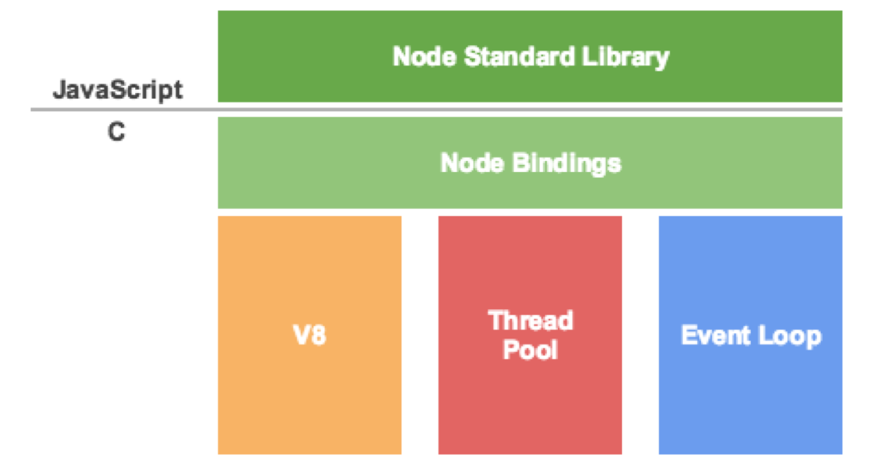
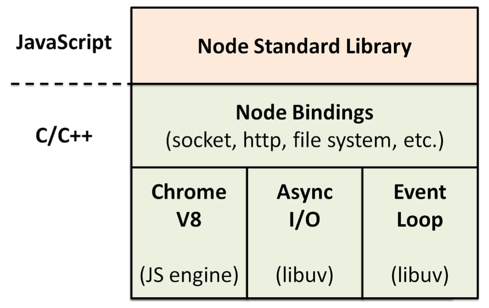

# 简介

## 基本原理

|       struct        |       library       |
| :-----------------: | :-----------------: |
|  |  |

- Chrome V8

  采用 C/C++ 编写, 可以独立运行,也可以用来嵌入到 C/C++ 应用程序中执行.

- Event Loop 事件循环

  事件模块是 Node.js 内置的对观察者模式"发布/订阅"(publish/subscribe)的实现,通过 EventEmitter 属性,提供了一个构造函数.该构造函数的实例具有 on 方法,可以用来监听指定事件,并触发回调函数.任意对象都可以发布指定事件,被 EventEmitter 实例的 on 方法监听到.

- Thread Pool 线程池

  JavaScript 语言是单线程,同一个时间只能做一件事单线程就意味着,所有任务需要排队,前一个任务结束,才会执行后一个任务.如果前一个任务耗时很⻓,后一个任务就不得不一直等着.

  如果排队是因为计算量大,CPU 忙不过来,倒也算了,但是很多时候 CPU 是闲着的,因为 I/O 很慢,不得不等着结果出来,再往下执行 CPU 完全可以不管 I/O 设备,挂起处于等待中的任务,先运行排在后面的任务将等待中的 I/O 任务放到 Event Loop 里由 Event Loop 将 I/O 任务放到线程池里只要有资源,就尽力执行

  > 实际上是模拟并发

  单线程的优势无需进程/线程切换上下文的成本

- 不带着问题去读源码是比?容易迷失在大量代码中的

- 工程师的能力不是编码和死磕,而是解决问题
  年轻死磕是为了⻓本事,30 岁以前都可以这样做带团队后,要懂得任务下放,让更多人帮你,别带人越多越累 30 岁之后是打牌阶段,技能积累足够用,这时要注重社交,打组合拳才能玩的更好

- 推荐学习

  - 了不起的 Node.js
  - Node in action

  > 前两本重点在于应用, 先用起来

  - 深入浅出 Node.js

  - 项目: https://github.com/parro-it/awesome-micro-npm-packages

## nodeJS

内置 V8

- 功能

  - 读写电脑文件
  - 连接数据库
  - web 服务器

- 运行方式

  - 交互式

    输入 node 即可进入环境

    `ctrl + C` 或 `.exit` 退出

  - 运行文件

    `node [fileName]`

nvm 是 node.js 版本管理工具。 npm 是 JavaScript 包管理工具

## NVM

nodeJS 的管理器

- `nvw`

  卸载`nodeJS`, 然后安装`nvm`

- 常用命令

  - `nvm list`
  - `nvm install [version]`
  - `nvm uninstall [version]`
  - `nvm use [version]`

    使用`nvm`安装 node 版本

## build-in module

|     Module     |                        Description                         |
| :------------: | :--------------------------------------------------------: |
|     assert     |             Provides a set of assertion tests              |
|     buffer     |                   To handle binary data                    |
| child_process  |                   To run a child process                   |
|    cluster     |   To split a single Node process into multiple processes   |
|     crypto     |         To handle OpenSSL cryptographic functions          |
|     dgram      |      Provides implementation of UDP datagram sockets       |
|      dns       |      To do DNS lookups and name resolution functions       |
|     domain     |           Deprecated. To handle unhandled errors           |
|     events     |                      To handle events                      |
|       fs       |                 To handle the file system                  |
|      http      |           To make Node.js act as an HTTP server            |
|     https      |          To make Node.js act as an HTTPS server.           |
|      net       |               To create servers and clients                |
|       os       |      Provides information about the operation system       |
|      path      |                    To handle file paths                    |
|    punycode    |          Deprecated. A character encoding scheme           |
|  querystring   |                To handle URL query strings                 |
|    readline    |      To handle readable streams one line at the time       |
|     stream     |                  To handle streaming data                  |
| string_decoder |           To decode buffer objects into strings            |
|     timers     | To execute a function after a given number of milliseconds |
|      tls       |             To implement TLS and SSL protocols             |
|      tty       |          Provides classes used by a text terminal          |
|      url       |                    To parse URL strings                    |
|      util      |                To access utility functions                 |
|       v8       |   To access information about V8 (the JavaScript engine)   |
|       vm       |      To compile JavaScript code in a virtual machine       |
|      zlib      |              To compress or decompress files               |

## import

```js
let http = require("http");
```

## export

```js
exports.myDateTime = function () {
  return Date();
};
```

## reference

- 了不起的 Node.js
- Node in action
- JavaScript 高级编程

  红皮书

- JavaScript 大全 犀牛书
- [JavaScript 权威指南](<https://awesome-programming-books.github.io/javascript/JavaScript%E6%9D%83%E5%A8%81%E6%8C%87%E5%8D%97(%E7%AC%AC6%E7%89%88).pdf>)

- 离线文档

  - [Dash](https://kapeli.com/dash)
  - [Zeal](https://zealdocs.org/)

- [关于 JavaScript 单线程的一些事](https://github.com/JChehe/blog/blob/master/posts/%E5%85%B3%E4%BA%8EJavaScript%E5%8D%95%E7%BA%BF%E7%A8%8B%E7%9A%84%E4%B8%80%E4%BA%9B%E4%BA%8B.md)
